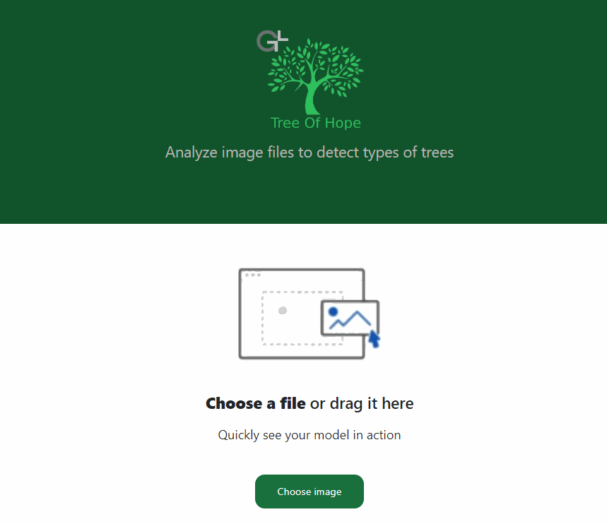

# Tree-of-Hope
The frontend part of project Tree of Hope. 
The concern of the project was to detect trees on images and give back the result.  
This repository contain only the front end part of this project, which can be used as template or code samples

